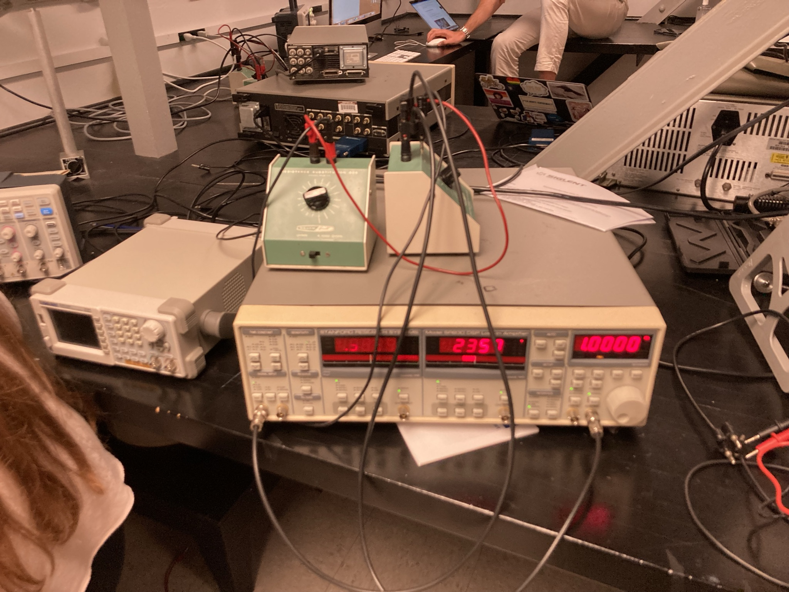

## First Project

On the first project, we analyze simple RC circuits using a siglent oscilloscope, and a signal generator. We then use LabVIEW to automate some analyses and record data.

We then use our ouput to analyze the data and study circuit behavior at different frequencies. We have organized the data into CSV/XLSX files. Although the default output of the recorded data from LabVIEW is in the .xlsx format, we change the format to CSV inorder to make it easier to use it with numpy.

## Code
The code for this project can be found on [Github](https://github.com/aaronkebede/phy220) and is also mirrored on [Gitlab](https://gitlab.com/aaronkebede/phy220). The visualizations we have are found on the directories `/project-NUM`, while `NUM` can be one, two etc.
## Data
We have done multiple experiments and hence have multiple data outputs.  
The data for each experiment can be found in the directory `/project-one/*version*/Readings/` 

We have three `version` of the data:

 - Hand Recorded Data (`hand-recorded-data`)
 - V1 - first version of data **without** the lock-in amplifier (`v1`)
 - **V2** - ***latest version*** of data **with** the lock-in amplifier(`v2`)

Older versions of data recorded can be found on here: [hand recorded data](https://github.com/aaronkebede/PHY220/tree/main/project-one/hand-recorded-data/Readings) & [V1](https://github.com/aaronkebede/PHY220/tree/main/project-one/v1/Readings)

### Latest Version

The data is organized into 4 files. Two of the files are `Frequency vs Amplitude` and `Frequency vs Phase Shift`. The other two are the same but with the lock-in amplifier included.

**CSV root**: [/project-one/v2/Readings/CSV](https://github.com/aaronkebede/PHY220/tree/main/project-one/v2/Readings/CSV)

**XLSX:** [/project-one/v2/Readings/xlsx](https://github.com/aaronkebede/PHY220/tree/main/project-one/v2/Readings/xlsx)

## Usage

Using the data is pretty straight forward. The outcome that we would like is to visualize the effect of frequency change on phase shift and amplitude. Here's a sample visualization:

    sample    = pd.read_csv("Readings/data.csv")
    sample = np.array(sample)
    sample_amp_diff   = sample[:,4]
    
    #Plot Amplitude Difference Against Frequency  
    
    plt.plot(sample_freq,sample_amp_diff, '--' ,lw=2, color='red')
    plt.grid()
    plt.title("Amplitude Difference vs Frequency")
    plt.xlabel("Frequency (KHz)")
    plt.ylabel("Amplitude Difference (V)")
    plt.show()
    
    #Plot Phase Shift Against Frequency  
    
    plt.plot(sample_freq,sample_phase_diff, '--' , lw=2, c='chocolate')
    plt.grid()
    plt.title("Phase Shift vs Frequency")
    plt.xlabel("Frequency (KHz)")
    plt.ylabel("Phase Shift (degrees)")
    plt.show()
    

For more visualizations and plots we used on our lab project, read [Code](#Code)
# Questions?
If you have questions or want to make suggestions, the most ideal way would be to [create an issue](https://github.com/aaronkebede/PHY220/issues/new/choose) or [a pull request](https://github.com/aaronkebede/PHY220/compare) on Github. You can also email me at aaron.kebede@lehigh.edu with questions.
